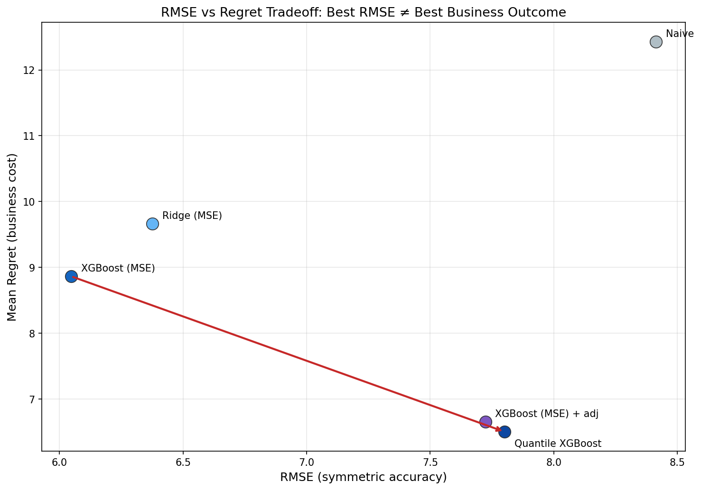
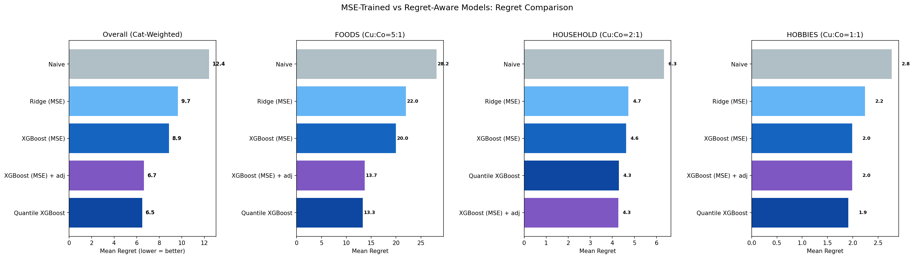

# Cost-Aware Demand Forecasting for Retail Inventory

Which forecast is "best" depends on what a mistake costs. This project forecasts daily sales for 30 category-store groups across 10 Walmart stores (California, Texas, Wisconsin) using the [M5 Forecasting](https://www.kaggle.com/competitions/m5-forecasting-accuracy) dataset. It then judges models by **inventory cost**, not by accuracy alone.

**Key result:** Quantile XGBoost cut mean daily inventory cost (regret) by **26.6%** compared with the most accurate model, even though its RMSE was worse. A model's training objective should match the cost of the business decision it supports.



## Results

Evaluated on an 8-week holdout (56 days × 30 groups).

| Strategy | Mean daily regret | vs. XGBoost (MSE) |
|---|---:|---:|
| Seasonal Naive | 12.43 | +40.2% |
| Ridge (MSE) | 9.66 | +9.0% |
| XGBoost (MSE) | 8.86 | baseline |
| XGBoost (MSE) + post-hoc quantile adjustment | 6.66 | −24.9% |
| **Quantile XGBoost** | **6.50** | **−26.6%** |

On accuracy alone, the RMSE ranking is XGBoost (6.05), then Ridge (6.38), then Seasonal Naive (8.41). The most accurate model isn't the cheapest one to run inventory on.



## Approach

1. **External data.** Five pipelines add demand drivers that the M5 dataset doesn't include:
   - SNAP benefit issuance timing (14-day proximity decay)
   - Holidays and events (proximity and a 1–5 magnitude score)
   - NOAA daily weather from airport stations near each store
   - FRED unemployment and CPI, and EIA gas prices, forward-filled to daily
   - School sessions, breaks and back-to-school timing
2. **Aggregation.** Item-level series are too sparse (about half of all days have zero sales). Sales are summed to category × store, giving 30 groups that match how inventory is planned.
3. **Features.** Lags (7, 14, 28 days), rolling means, standard deviations and maxima, and price changes. Relative price uses training-period means only, to avoid leakage.
4. **Models.** Seasonal Naive, Ridge regression and XGBoost, all trained to minimize squared error.
5. **Cost model.** A newsvendor model with category-specific ratios of understock to overstock cost: Food 5:1, Household 2:1, Hobbies 1:1. Regret is the extra cost compared with perfect foresight.
6. **Cost-aware models.** The project compares two fixes:
   - Shifting MSE forecasts after training by a quantile of the residuals
   - Training Quantile XGBoost directly at each category's critical ratio

   Direct training wins because it learns feature-specific shifts without assuming normally distributed errors.

## Repository

```
notebooks/
  01_EDA.ipynb                 exploration and sparsity check
  01a_snap_issuance.ipynb      SNAP benefit timing features
  01b_event_proximity.ipynb    holiday and event features
  01c_weather.ipynb            NOAA weather (needs NOAA_TOKEN)
  01d_macro_indicators.ipynb   FRED and EIA indicators (needs FRED_API_KEY, EIA_API_KEY)
  01e_school_calendar.ipynb    school calendar features
  02_feature_engineering.ipynb merge, aggregate, engineer features
  03_modeling.ipynb            Naive, Ridge, XGBoost
  04_regret_strategies.ipynb   newsvendor regret and quantile models
  05_cost_calculation.ipynb    inventory cost by strategy
data/clean/    external feature tables (pre-fetched)
data/output/   feature matrix, predictions, regret results
models/        trained Ridge pipeline and XGBoost model
figures/       charts produced by the notebooks
```

## Running it

1. Install dependencies: `pip install -r requirements.txt`
2. Download `calendar.csv`, `sales_train_validation.csv` and `sell_prices.csv` from the [M5 competition page](https://www.kaggle.com/competitions/m5-forecasting-accuracy/data) into `data/raw/`. The raw files aren't included here because of their size and Kaggle's data terms.
3. Run the notebooks in order from the `notebooks/` folder. The external data is already in `data/clean/`, so notebooks 02–05 run without API keys. Notebooks 01c and 01d need free API keys only if you want to fetch the data again; set them as environment variables or Colab Secrets.

To run on Google Colab instead, uncomment the Drive-mount lines at the top of each notebook.

## Tools

Python, pandas, NumPy, scikit-learn, XGBoost, SHAP, SciPy, Matplotlib, seaborn
